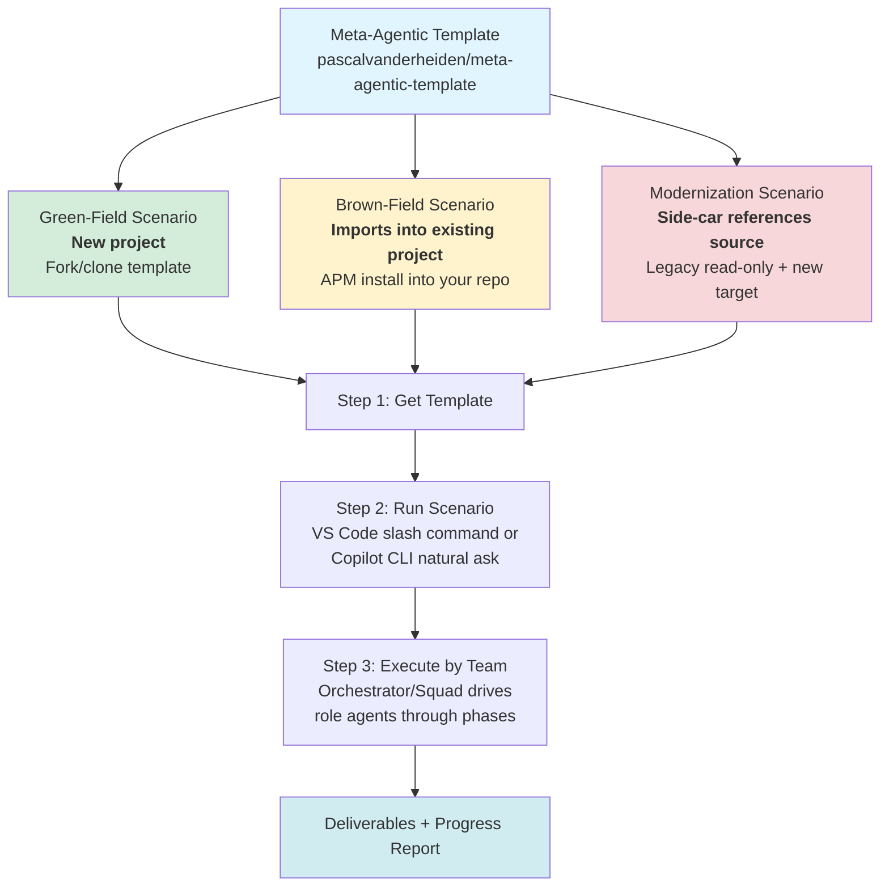
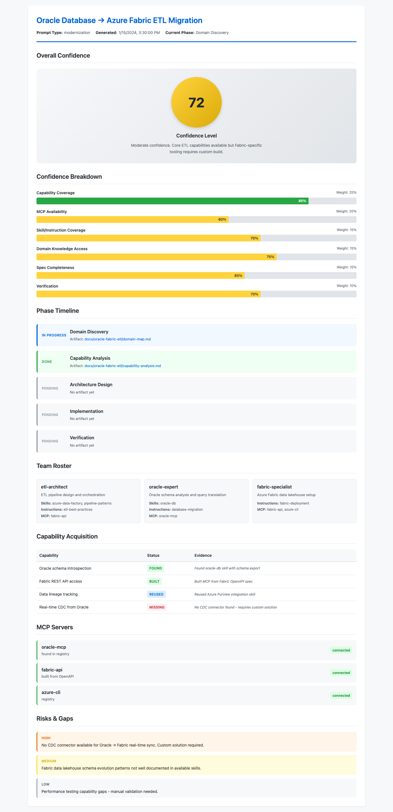

# Meta-Agentic Template for GitHub Copilot

A framework for orchestrating AI-powered development teams using Spec-Driven Development (SDD). Forms custom agent teams, discovers/builds capabilities (skills, MCP servers), and delivers verified solutions with real-time confidence scoring.

## How This Meta-Template Works



*This meta-template generates a focused agentic workspace tuned to your scenario — each relates to source code differently: green-field creates new, brown-field works in-place, modernization references legacy read-only.*

## Prerequisites

- **VS Code** with GitHub Copilot OR **Copilot CLI**
- **GitHub Copilot subscription**
- **Node.js v18+** (for MCP server generation)
- **Git**
- **Optional**: `gh` CLI for Squad workflows
- **Optional**: an SDD framework (Spec-Kit / OpenSpec / Superpowers) — only if you choose that path (see [Optional: SDD Frameworks](#optional-sdd-frameworks))

## Quick Start Guide

### Step 1 — Get the Template

**For green-field (building new):** Fork or clone this template repository.

**For brown-field or modernization (working with existing code):** Install the agentic artifacts into your existing repository using APM (see [Use on an Existing Codebase (APM)](#use-on-an-existing-codebase-apm) below).

### Step 2 — Run the Scenario

Choose the scenario that matches your situation:

| Scenario | Use When | Default SDD Framework |
|----------|----------|----------------------|
| **Green-Field** | Building a **new system** from scratch | OpenSpec |
| **Brown-Field** | Extending or modifying an **existing codebase** | None (native pipeline) |
| **Modernization** | Migrating platforms or modernizing **legacy systems** | Spec-Kit |

**In VS Code** (slash command):
```
@workspace /green-field Build a task management API with Node.js and PostgreSQL
@workspace /brown-field Add real-time notifications to our Express app
@workspace /modernization Migrate Oracle ETL pipeline to Microsoft Fabric
```

**In Copilot CLI** (skill-based):
Start `copilot` and ask naturally. Examples:
```
"Run the green-field workflow to build a task management API with Node.js and PostgreSQL"
"Run the brown-field workflow to add real-time notifications to our Express app"
"Run the modernization workflow to migrate our Oracle ETL pipeline to Microsoft Fabric"
```

The agent will trigger the matching scenario skill, which delegates to the authoritative `.github/prompts/<scenario>.prompt.md` workflow.

**Intake questions:**
- **Execution Approach**: Choose **(A) Custom Agents** for simple workflows or **(B) Squad Team** (default) for complex multi-agent orchestration
- **SDD Framework**: Choose **(1) None**, **(2) Spec-Kit**, **(3) OpenSpec**, or **(4) Superpowers** — or accept the scenario's recommended default
- **Scenario-specific details**: Stack preferences, constraints, success criteria, scope boundaries

### Step 3 — Execute by Team

The workflow proceeds through 10 phases (Intake → Discovery/Assessment → Analysis → Capability Mapping → Capability Acquisition → Team Formation → Execution → Verification → Handoff).

**The execution lead** (Orchestrator for Custom Agents, or Squad coordinator for Squad Team) invokes role agents in handoff order, enforces strict reviewer gates (original author cannot revise rejected work), runs the SDD framework's implement loop (if chosen), and reports back.

**Review the progress report**: Open `docs/<scenario>-<slug>/progress-report.html` in your browser for real-time status, confidence scores, team roster, and capability tracking.

## Example Prompts

**Green-Field (new build):**
```
@workspace /green-field Build a customer portal with Next.js, Tailwind CSS, and Supabase. 
Include user authentication, profile management, and a dashboard showing order history. 
Deploy to Vercel.
```

**Brown-Field (extend existing):**
```
@workspace /brown-field Add OAuth 2.0 authentication to our existing Express.js REST API. 
Support Google and GitHub providers. Maintain backward compatibility with the current 
JWT token system. The API is in src/api/ and uses Passport.js.
```

**Modernization (migrate legacy):**
```
@workspace /modernization Modernize our Angular 1.x e-commerce app to React 18 with TypeScript. 
Consume the existing REST API unchanged. Reuse our Playwright E2E suite as a parity oracle 
to ensure the React app behaves identically. The legacy app is in legacy/ and uses Grunt.
```

## Execution Approaches

Both approaches use **identical** agent roles, skills, and MCP servers. Only orchestration differs.

| Aspect | **A. Custom Agents** | **B. Squad Team (Default)** |
|--------|---------------------|--------------------------|
| **Setup** | Generate `.agent.md` files in `.github/agents/` | Use pre-installed Squad coordinator |
| **Orchestration** | Orchestrator agent invokes roles individually | Squad spawns agents, enforces handoffs |
| **Parallelism** | Manual via task tool | Built-in parallel fan-out |
| **Reviewer Gate** | Enforced by Orchestrator | Enforced by Squad |
| **Best For** | Linear workflows, 2-3 agents | Complex coordination, 4+ agents |

Squad is **pre-installed** (`.github/agents/squad.agent.md`) and recommended for multi-agent scenarios.

## Optional: SDD Frameworks

Each scenario can optionally run on a spec-driven-development framework. This is **orthogonal** to the execution approach above (you can combine any framework with Custom Agents *or* Squad). The default is **None** — the native pipeline, which needs no extra install.

**If (and only if) you choose a framework, install it first:**

| Framework | Install | Recommended default for |
|-----------|---------|-------------------------|
| **None** (native) | Nothing — runs out of the box | Brown-field |
| **OpenSpec** | `npm install -g @fission-ai/openspec@latest && openspec init` | Green-field |
| **GitHub Spec-Kit** | `uvx --from git+https://github.com/github/spec-kit.git specify init . --integration copilot` (needs [uv](https://docs.astral.sh/uv/)/Python) | Modernization |
| **Superpowers** | Install the Superpowers skills plugin — see [github.com/obra/superpowers](https://github.com/obra/superpowers) | Any (quality/TDD overlay) |

Defaults are **recommendations, not mandates** — the scenario prompt asks during Intake and you can pick any option (or None). Details: `.github/skills/meta-agentic-method/SKILL.md` § *SDD Framework Selection (Optional)*.

## Use on an Existing Codebase (APM)

Green-field: fork/use this template. Brown-field or modernization: install the agentic artifacts into your existing repo; no fork required.

```bash
apm install \
  pascalvanderheiden/meta-agentic-template/.github/prompts/green-field.prompt.md \
  pascalvanderheiden/meta-agentic-template/.github/prompts/brown-field.prompt.md \
  pascalvanderheiden/meta-agentic-template/.github/prompts/modernization.prompt.md \
  pascalvanderheiden/meta-agentic-template/.github/skills/meta-agentic-method \
  pascalvanderheiden/meta-agentic-template/.github/skills/progress-report \
  pascalvanderheiden/meta-agentic-template/.github/skills/github-issues \
  pascalvanderheiden/meta-agentic-template/.github/skills/repo-wiki \
  pascalvanderheiden/meta-agentic-template/.github/skills/green-field \
  pascalvanderheiden/meta-agentic-template/.github/skills/brown-field \
  pascalvanderheiden/meta-agentic-template/.github/skills/modernization \
  pascalvanderheiden/meta-agentic-template/.github/skills/find-skills \
  pascalvanderheiden/meta-agentic-template/.github/skills/mcp-builder \
  pascalvanderheiden/meta-agentic-template/.github/instructions \
  pascalvanderheiden/meta-agentic-template/.github/agents/squad.agent.md \
  pascalvanderheiden/meta-agentic-template/.github/agents/orchestrator.agent.md
apm install --mcp io.github.github/github-mcp-server --transport http
apm install --mcp microsoft/playwright-mcp
```

Pulls: 3 scenario prompts, 3 scenario skills (for Copilot CLI invocation), meta-agentic-method/progress-report/github-issues/repo-wiki/find-skills/mcp-builder skills, authoring instructions, Squad agent, Orchestrator agent, and GitHub + Playwright MCP servers. If APM cannot auto-detect Copilot, append `--target copilot`. The upstream feedback loop still works: `github-issues` + GitHub MCP travel with the install, issues file to this template repo, and `apm.lock.yaml` pins what you ran. See `.github/skills/meta-agentic-method/SKILL.md` § *Repository Topology by Scenario* for where work happens.

## How It Works

The workflow executes a **10-phase SDD pipeline**:

1. **Intake** → Clarify scenario, choose Execution Approach and optional SDD Framework
2. **Discovery** (brown-field/modernization) → Inventory existing system, generate repo-wiki
3. **Assessment** (modernization) → Legacy-to-target gap analysis
4. **Analysis** → Decompose into functional domains
5. **Capability Mapping** → Find skills, MCP servers, instructions
6. **Capability Acquisition** → Reuse or build missing capabilities
7. **Team Formation** → Assign capabilities to agent roles, designate execution lead and reviewer
8. **Execution** → Execution lead (Orchestrator or Squad) invokes agents, enforces reviewer gates, runs SDD framework workflow
9. **Verification** → Validate deliverables, calculate confidence score
10. **Handoff** → Generate README + real-time HTML progress report

**Confidence Score** (0-100):
- Weighted across 6 dimensions: Capability Coverage (25%), MCP Availability (20%), Skill Coverage (15%), Domain Knowledge (15%), Spec Completeness (15%), Verification (10%)
- **Green (80-100)**: Ready for production
- **Amber (50-79)**: Viable with gaps
- **Red (0-49)**: Blockers present

**Progress Report** (`docs/<scenario>-<slug>/progress-report.html`):
- Real-time updates after each phase
- Self-contained, no network required
- Open in any browser

Full methodology: `.github/skills/meta-agentic-method/SKILL.md`

## Status Report

The real-time HTML report provides visibility into workflow execution:



**Key Elements:**
- **Overall Confidence Gauge** (0-100) with color bands (green/amber/red)
- **6 Dimension Breakdown**: Capability Coverage, MCP Availability, Skill Coverage, Domain Knowledge, Spec Completeness, Verification Status
- **Phase Timeline**: Pending → In Progress → Done → Blocked
- **Team Roster**: Agents with assigned skills, instructions, MCP servers
- **Capability Acquisition**: Found/Built/Reused/Missing status
- **Risks & Gaps**: Critical/High/Medium/Low severity

Report updates after each phase. Open `docs/<scenario>/progress-report.html` in browser (self-contained, no network required).

## Repository Structure

| Path | Purpose |
|------|---------|
| `.github/prompts/` | Scenario workflows (green-field.prompt.md, brown-field.prompt.md, modernization.prompt.md) |
| `.github/skills/` | Reusable skills: `meta-agentic-method` (methodology + references), `progress-report`, `green-field`, `brown-field`, `modernization` (scenario wrappers), `find-skills`, `mcp-builder`, `skill-creator`, `github-issues`, `repo-wiki` |
| `.github/instructions/` | Authoring guidelines: `agents.instructions.md`, `agent-skills.instructions.md`, `instructions.instructions.md`, `prompt.instructions.md`, `hooks.instructions.md` |
| `.github/agents/` | Custom agents: `squad.agent.md` (Squad coordinator), `orchestrator.agent.md` (Custom Agents execution lead) |
| `.squad/` | Squad team management (team.md, routing.md, decisions.md, agent folders) |


## Conventions

- **File naming**: `kebab-case` (`.agent.md`, `.instructions.md`, `.prompt.md`)
- **Format**: Markdown with YAML frontmatter (single-quoted strings)
- **Portability**: Works across VS Code, Copilot CLI, GitHub.com
- **Quality**: Follow matching `.github/instructions/` guideline for artifact type

See `.squad/decisions.md` for standing decisions.

---

**License**: MIT  
**Author**: Pascal van der Heiden

For questions or contributions, open an issue or submit a pull request.
